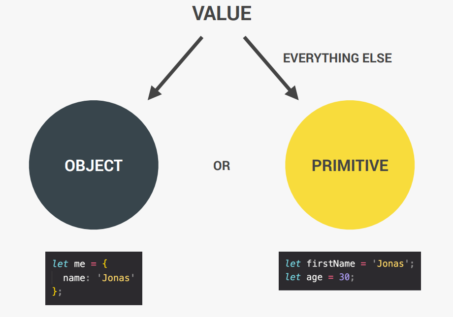

# Data Types

---
## There are **seven** data types:

- **Number**: Floating point numbers, used for decimals and integers `let age = 23;`
- **String**: Sequence of characters, used for text `let firstName = "Leeking"; || let firstName = 'Leeking';`
- **Boolean**: Logical type that can only be `true` or `false`, used for taking decisions `let fullAge = true;`
- **Undefined**: Value taken by variable that is not yet defined ('empty value') `let children;`
- **Null**: Also means 'empty value'.
- **Symbol *(ES2015)***: Value that is unique and cannot be changed.
- **BigInt *(ES2020)***: Larger Integers than the Number type can hold.

>## ☝️ **JavaScript has dynamic typing**:
>We do *NOT* have to manually define data type of the value stored in a variable. INSTEAD, data types are determined *automatically*.